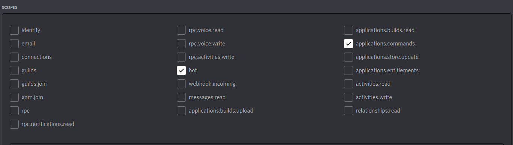

# Next Hime Project


<a href="https://codeclimate.com/github/yupix/NextHime/maintainability"></a> <a href="https://codeclimate.com/github/yupix/NextHime/test_coverage"></a>

## 概要

このProjectは [SSM](https://github.com/yupix/ssm) の後継作です。
また、このProjectは[AGPL](LICENSE)ライセンスのもと配布または使用できます

## OS毎の依存関係

### ArchLinux | Neon(Ubuntu)

- libpq-dev 
- python3.9-dev # 3.9は使用しているバージョンによる
- postgresql
- git
- base-devel

### Windows10 | Windows11

Windowsは依存関係を整えればWindows11での動作も確認していますが、これは初期段階での検証であり。
今後のアップデートでUnix専用のパッケージなどを追加することによって正常に動作しなくなる可能性があります。
また、これらは過去の断片的な記憶から書いている依存関係であり、実際は他の依存関係も必要かもしれません。

- postgresql
- git

## セットアップ方法

```shell
git clone https://github.com/yupix/NextHime.git  # プロジェクトをclone 
cd NextHime  # cloneしたプロジェクトに移動
python3 -m virtualenv .venv  # 仮想環境の作成

# 仮想環境の有効化
  # Linuxの場合
  source ./.venv/bin/activate
  # Windowsの場合
  .venv\Scripts\activate.bat

pip install -r requirements.txt  # 依存関係のインストール

python3 run.py  # 実行 
```

### Discord BOTの設定
BOTを招待する際のSCOPES


INTENTSの設定


## 開発者向け情報

- このプロジェクトをPycharmなどのエミュレート端末で動作させるとinputtimeoutが正常に動作しない可能性があります。**この問題は通常の非エミュレート端末では発生しません**
